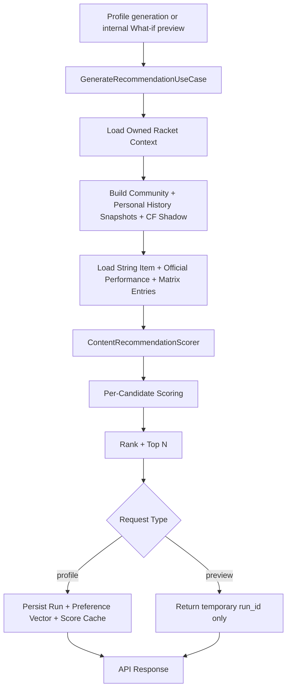
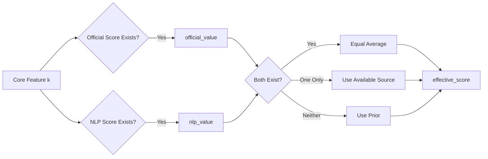

# Recommendation Design (Current Runtime)

## 1. Scope

This document describes the current recommendation runtime in `backend/app/domain/recommendation/scoring.py`.

Persisted algorithm identifier:

- `fyp1_weighted_preferences_feedback_racket_cf_personal_v14`

Design style:

- Content-based scoring as the main signal
- Rule-based adjustments for profile-context constraints
- Gauge, feel, tension, frequency, and recent-goal rule adjustments
- Fixed official/NLP feature fusion without confidence or review-count weighting
- Bounded structured-feedback calibration, preferring exact racket-model evidence
- Bounded personal-history reranking from the current player's completed feedback
- Racket-conditioned collaborative filtering with a three-user activation gate

Collaborative evidence is observable and persisted. It receives a non-zero,
shrunk weight only when one candidate has at least three independent supporting
users on the exact normalized racket model. Sparse cases preserve the base score.

## 2. End-to-End Runtime Flow



Primary orchestration lives in `app/use_cases/recommendation/generate_recommendation.py`.

## 3. Data Inputs and Signal Layers

### 3.1 User-side inputs

- Profile context: `skill_level`, `playing_style`, `preferred_tension`, `frequency_per_week`, `preferred_feel`, `preferred_gauge`, and `recent_goal`.
- Preference sliders (1-10): `pref_attack`, `pref_control`, `pref_durability`, `pref_comfort`, `pref_sound`, `pref_elasticity`, `pref_tension_retention`, `pref_string_movement`, `pref_value_for_money`.

Note:

- `pref_value_for_money` is the ninth dimension in the normalized preference vector used by `PreferenceMatch`.

### 3.2 Item-side inputs

- Official/manual performance (`string_official_performance`) for core dimensions.
- Matrix rows (`string_recommendation_matrix`) by `source_layer`, especially:
    - `nlp_review` (primary matrix source used by core-feature fusion)
    - `hybrid_derived` (used in auxiliary/support feature fallback)
    - `feedback_signal` (catalog feedback-derived auxiliary/support feature fallback)
    - `catalog_structured` (metadata-oriented; generally not used directly in core content fusion)

### 3.3 Feature mapping note

- CSV `attack` is mapped into runtime feature key `repulsion`.
- This is why "power" behavior is represented through `repulsion` in scorer logic.

## 4. Content-Based Design

### 4.1 Core feature space

Content matching is built around 9 core dimensions:

- `repulsion`
- `control`
- `durability`
- `comfort`
- `sound`
- `elasticity`
- `tension_retention`
- `string_movement`
- `value_for_money`

### 4.2 Preference vector construction

Raw user sliders are normalized into preference weights:

$$
w_i = \frac{r_i}{\sum_j r_j}
$$

Where:

- $r_i$ is the raw slider value for core feature $i$
- $w_i$ is the normalized preference weight

### 4.3 Fixed per-feature fusion

For each core feature, scorer combines official signal, NLP signal, and prior fallback without evidence-confidence metadata.



High-level behavior:

- If official and NLP both exist: equal average.
- If only one side exists: use that side directly.
- If both missing: fallback to feature prior.

Official coverage caveat:

- Official mapping currently covers 5 core dimensions directly: `repulsion`, `comfort`, `control`, `durability`, `sound`.
- `elasticity`, `tension_retention`, and `string_movement` mainly rely on NLP matrix signals or prior fallback.

Catalog review counts are not recommendation inputs.

### 3.4 Runtime learning signals

- Explicitly confirmed structured feedback is averaged per user before aggregation.
- Exact normalized racket-model evidence is preferred; global string evidence is
  the fallback. Influence is shrunk with `K=10` and capped at `0.30` per feature.
- The current player's `string_satisfaction` and `would_use_again` fields are
  kept separate from community calibration and CF. Personal evidence prefers
  the exact physical `racket_id`, then the exact normalized racket model, then
  the player's global history for that string. Its weight is shrunk with
  `K=3` and capped at `0.08`.
- Completed bookings from similar users on the exact racket model produce a
  tension-aware CF score. Its runtime weight remains `0.0` below three distinct
  supporters and is otherwise dynamically shrunk and capped at `0.20`.
- Snapshot/source hashes are stored in rationale and checked on cached reads.

### 4.4 PreferenceMatch calculation

PreferenceMatch is the weighted absolute score across the nine effective item
features. Feedback calibration is applied to those features before this step.

$$
\text{PreferenceMatch} =
\frac{\sum_i w_i \cdot \text{EffectiveFeatureScore}_i}{\sum_i w_i}
$$

This keeps the score on `0..1` while avoiding the high cosine similarity caused
by comparing two positive, similarly shaped vectors.

## 5. Rule-Based Design

RuleFit starts from baseline `0.55` and applies incremental deltas based on profile context and item behavior.

An explicit gauge preference takes precedence over the gauge inferred from
skill, tension, and playing frequency, so the same gauge is never scored twice.

### 5.1 Rule categories

1. Skill-level rules
2. Frequency rules
3. Tension rules
4. Playing-style rules
5. Preferred feel, preferred gauge, and structured recent-goal rules

### 5.2 Rule table (current runtime)

| Category | Condition | Delta |
| --- | --- | --- |
| Gauge context | beginner without tension/frequency override and thin gauge | +0.07 |
| Gauge context | tension <= 23, tension >= 27, or frequency >= 3 and thick gauge | +0.07 |
| Preferred gauge | exact match / mismatch | +0.05 / -0.025 |
| Preferred feel | soft/medium/hard exact match / mismatch | +0.06 / -0.03 |
| Beginner | (comfort + durability)/2 >= 0.65 | +0.06 |
| Frequent play | frequency_per_week >= 3 and durability < 0.50 | -0.08 |
| Frequent play | frequency_per_week >= 3 and durability >= 0.68 | +0.05 |
| High tension | preferred_tension >= 27 and tension_retention >= 0.68 | +0.06 |
| High tension | preferred_tension >= 27 and tension_retention < 0.55 | -0.06 |
| Low tension | preferred_tension <= 23 and comfort >= 0.66 | +0.04 |
| Attacking style | 0.6*repulsion + 0.4*elasticity >= 0.72 | +0.07 |
| Attacking style | repulsion < 0.55 | -0.05 |
| Control style | 0.55*control + 0.45*string_movement >= 0.68 | +0.07 |
| Control style | string_movement < 0.50 | -0.05 |
| Balanced style | mean(repulsion, control, durability, comfort, elasticity, tension_retention, string_movement) >= 0.66 | +0.05 |
| Recent goal | selected feature >= 0.68 / <= 0.48 | +0.06 / -0.04 |

All deltas are clamped into `[0,1]` after each update.

### 5.3 Rule decision map


## 6. Setup Preference Design

Gauge, feel, and recent goal are RuleFit inputs. They add a bounded bonus or
penalty but never filter candidates.

- Gauge categories: thin `<= 0.64 mm`, medium `<= 0.67 mm`, otherwise thick.
- Setup context prefers thick gauge at `<= 23 lbs`, `>= 27 lbs`, or at least
  three sessions per week; otherwise beginner prefers thin gauge.
- Official feel values map to soft `<= 4`, medium `<= 6.5`, otherwise hard.
- Recent goal is one of balanced, power, control, durability, comfort,
  tension retention, or value for money.

Catalog price remains available for display but is not a ranking input.

## 8. Final Score and Ranking

The base score preserves the 5:1 preference-to-rule ratio and normalizes the
two ranking components back to the 0-to-1 range:

$$
\text{BaseScore} =
\frac{0.75 \cdot \text{PreferenceMatch}
+ 0.15 \cdot \text{RuleFit}}{0.90}
$$

Personal history first produces a small adjusted base score:

```text
personal_history_score =
    0.60 * would_use_again_ratio
  + 0.40 * normalized_string_satisfaction

personal_history_weight = 0.08 * feedback_count / (feedback_count + 3)
personalized_base_score = BaseScore * (1 - personal_history_weight)
                         + personal_history_score * personal_history_weight
```

Missing personal fields are omitted from the weighted average. With no current
player history, `personalized_base_score = BaseScore` exactly. CF then applies
its existing bounded blend to `personalized_base_score` only when the existing
three-independent-user gate is met.

Ranking is then sorted by:

1. `FinalScore` descending
2. `brand`
3. `model_name` (or fallback to display name)

Top `N` is returned.

## 9. Explainability and Persistence

For each result, scorer stores:

- score breakdown (`preference_match`, `rule_fit`, descriptive `value_for_money`, optional `nlp_review_score`)
- top reasons and rule events
- feature evidence rows with official value, NLP value, fixed NLP contribution, and effective score
- feedback scope, counts, bounded weight, and source/snapshot versions
- personal-history scope, completed-feedback count, component values, bounded
  weight, and personal snapshot version
- selected racket context and gated CF evidence with base/final score audit fields

The player result and detail screens use the grounded recommendation Agent to
turn this saved rationale into natural language. The mobile UI keeps only
structured context and evidence badges; personal, community, and similar-player
evidence is displayed only when its persisted usage flag is true. If the Agent
is unavailable, the saved `top_reasons` remains the bounded fallback.

Persistence behavior by request type:

- Profile only:
    - recommendation run snapshots (`recommendation_runs`, `recommendation_run_items`)
    - normalized user preference vector (`user_preference_matrix`, source `profile`)
    - per-item score cache (`recommendation_score_cache`)
- Internal What-if preview:
    - returns an ephemeral `run_id` for the current response context
    - does not write recommendation runs, run items, preference vectors, score cache, or profile changes

## 10. Design Summary

The current design is a hybrid recommender:

- Content-based is the primary decision engine
- Rule-based enforces profile-aware domain constraints
- Value for money is a first-class weighted preference
- Official and NLP feature values use fixed, inspectable fusion
- Eligible feedback calibrates features within a fixed bound
- Racket-conditioned CF is auditable and affects ranking only after its support gate

This keeps recommendations explainable, tunable, and stable for FYP use while still allowing NLP-derived signals to improve personalization dynamically.

## 11. FYP2 Architecture Conformance (2026-08-30)

| Boundary | Review result | Evidence in the current runtime |
| --- | --- | --- |
| Single ranking owner | **Pass** | Mobile calls the recommendation API; `GenerateRecommendationUseCase` builds evidence and `ContentRecommendationScorer` owns scoring and Top-N ordering. The Agent explains or compares results but does not rank strings. |
| Feedback learning loop | **Pass** | Community feature-rating fields in `booking_feedback` are exposed as `FeedbackRow`, aggregated by `build_feedback_snapshot`, and applied once by `_apply_feedback`; the current player's satisfaction/reuse fields use a separate bounded personal snapshot. Eligible changes invalidate the active cache version; text-only feedback remains non-ranking. |
| CF boundary | **Pass** | Completed interactions use exact canonical racket-model keys, exclude the current user, include missing-tension peers only in the denominator, gate influence at three distinct supporters, and cap the blend at 20%. |
| NLP boundary | **Pass** | The reviewed MacBERT/NLP workbook is an offline matrix source. Runtime feedback changes bounded feature calibration; it does not retrain or promote an NLP model. |
| Cohort and cold start | **Pass** | Repository candidate filtering remains bounded to the approved 12-string cohort and inventory availability; absent feedback or unsupported CF returns the content/rule baseline. |
| Explainability and audit | **Pass** | Response rationale includes feature evidence, feedback scope/weight/version, racket context, CF support, fallback reason, and base/final scores. |
| Academic effectiveness claim | **Not claimed** | No expert gold labels, NDCG/hit-rate evaluation, or production-accuracy claim is introduced by this change. The current evidence demonstrates signal influence and safe fallbacks only. |

The active runtime name is `fyp1_weighted_preferences_feedback_racket_cf_personal_v14`.
Catalog feedback metrics are descriptive provenance and are not a second ranking
signal; current ranking uses the bounded community snapshot, personal-history
snapshot, and existing CF evidence as separate layers.
