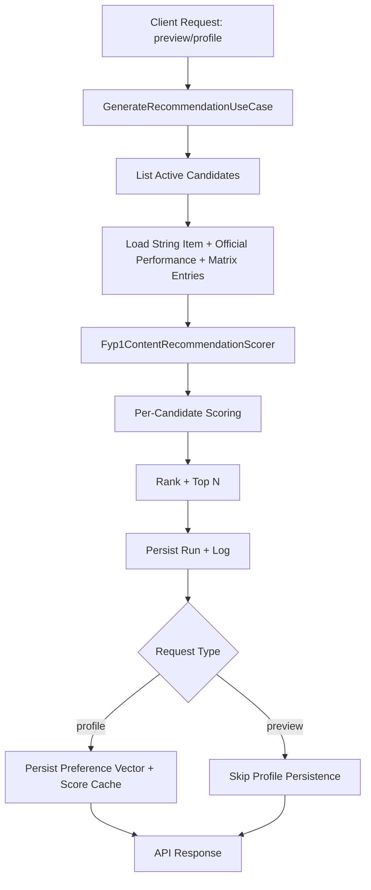
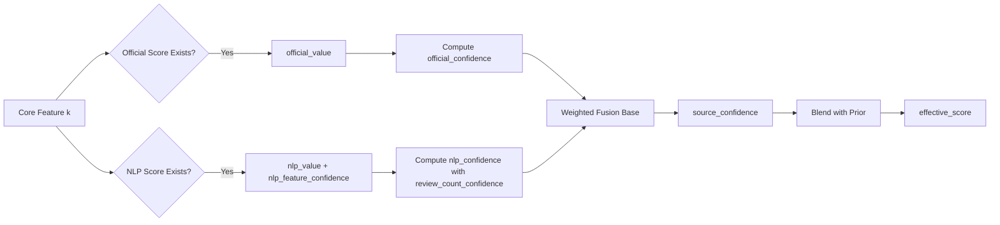
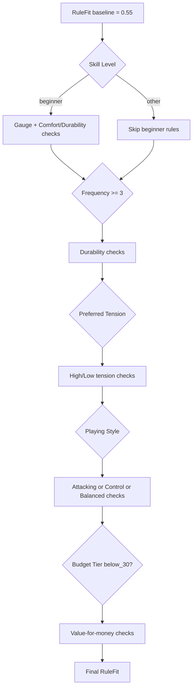

# Recommendation Design (FYP1)

## 1. Scope

This document describes the current recommendation runtime in `backend/app/domain/recommendation/scoring.py`.

Algorithm version:

- `fyp1_similarity_confidence_rule_budget_tier_v5`

Design style:

- Content-based scoring as the main signal
- Rule-based adjustments for profile-context constraints
- Budget-tier fit as a separate component
- Evidence confidence as a reliability component

This is not collaborative filtering.

## 2. End-to-End Runtime Flow

Primary orchestration lives in `app/use_cases/recommendation/generate_recommendation.py`.

## 3. Data Inputs and Signal Layers

### 3.1 User-side inputs

- Profile context: `skill_level`, `playing_style`, `budget_tier`, `preferred_tension`, `frequency_per_week`, etc.
- Preference sliders (1-10): `pref_attack`, `pref_control`, `pref_durability`, `pref_comfort`, `pref_sound`, `pref_elasticity`, `pref_tension_retention`, `pref_string_movement`, `pref_value_for_money`.

Note:

- `pref_value_for_money` is profile context but not part of the 8-dimension normalized preference vector used by `PreferenceMatch`.

### 3.2 Item-side inputs

- Official/manual performance (`string_official_performance`) for core dimensions.
- Matrix rows (`string_recommendation_matrix`) by `source_layer`, especially:
    - `nlp_review` (primary matrix source used by core-feature fusion)
    - `hybrid_derived` (used in auxiliary/support feature fallback)
    - `community_signal` (optional auxiliary/support feature fallback)
    - `catalog_structured` (metadata-oriented; generally not used directly in core content fusion)
- Feature-level confidence from matrix rows (`confidence` column).

### 3.3 Feature mapping note

- CSV `attack` and `attack_confidence` are mapped into runtime feature key `repulsion`.
- This is why "power" behavior is represented through `repulsion` in scorer logic.

## 4. Content-Based Design

### 4.1 Core feature space

Content matching is built around 8 core dimensions:

- `repulsion`
- `control`
- `durability`
- `comfort`
- `sound`
- `elasticity`
- `tension_retention`
- `string_movement`

### 4.2 Preference vector construction

Raw user sliders are normalized into preference weights:

$$
w_i = \frac{r_i}{\sum_j r_j}
$$

Where:

- $r_i$ is the raw slider value for core feature $i$
- $w_i$ is the normalized preference weight

### 4.3 Dynamic per-feature fusion

For each core feature, scorer fuses official signal, NLP signal, and prior fallback.

High-level behavior:

- If official and NLP both exist: weighted merge.
- If only one side exists: use that side with reliability scaling.
- If both missing: fallback to feature prior.

Official coverage caveat:

- Official mapping currently covers 5 core dimensions directly: `repulsion`, `comfort`, `control`, `durability`, `sound`.
- `elasticity`, `tension_retention`, and `string_movement` mainly rely on NLP matrix signals or prior fallback.

`review_count` is converted into `review_count_confidence` and influences NLP trust dynamically.

### 4.4 PreferenceMatch calculation

PreferenceMatch combines:

- weighted shape similarity between user vector and item feature shape
- top-priority feature alignment

High-level composition:

$$
\text{PreferenceMatch} = 0.75 \cdot \text{ShapeSimilarity} + 0.25 \cdot \text{TopAlignment}
$$

## 5. Rule-Based Design

RuleFit starts from baseline `0.55` and applies incremental deltas based on profile context and item behavior.

### 5.1 Rule categories

1. Skill-level rules
2. Frequency rules
3. Tension rules
4. Playing-style rules
5. Budget-sensitive value rules

### 5.2 Rule table (current runtime)

| Category | Condition | Delta |
| --- | --- | --- |
| Beginner | gauge <= 0.63 | -0.10 |
| Beginner | (comfort + durability)/2 >= 0.65 | +0.06 |
| Frequent play | frequency_per_week >= 3 and durability < 0.50 | -0.08 |
| Frequent play | frequency_per_week >= 3 and durability >= 0.68 | +0.05 |
| High tension | preferred_tension >= 27 and tension_retention >= 0.68 | +0.06 |
| High tension | preferred_tension >= 27 and tension_retention < 0.55 | -0.06 |
| Low tension | preferred_tension <= 23 and comfort >= 0.66 | +0.04 |
| Attacking style | 0.6*repulsion + 0.4*elasticity >= 0.72 | +0.07 |
| Attacking style | repulsion < 0.55 | -0.05 |
| Control style | 0.55*control + 0.45*string_movement >= 0.68 | +0.07 |
| Control style | string_movement < 0.50 | -0.05 |
| Balanced style | mean(repulsion, control, durability, comfort, elasticity, tension_retention, string_movement) >= 0.66 | +0.05 |
| Budget-sensitive | budget_tier = below_30 and value_for_money >= 0.70 | +0.05 |
| Budget-sensitive | budget_tier = below_30 and value_for_money <= 0.45 | -0.06 |

All deltas are clamped into `[0,1]` after each update.

### 5.3 Rule decision map

## 6. BudgetFit Design

`BudgetFit` is a categorical compatibility score between user budget tier and item price tier.

Price tier:

- `low` if `price_rm < 30`
- `mid` if `30 <= price_rm <= 50`
- `high` if `price_rm > 50`
- `unknown` if missing price

Budget fit lookup matrix:

| User budget tier | low | mid | high | unknown |
| --- | --- | --- | --- | --- |
| below_30 | 1.00 | 0.58 | 0.25 | 0.45 |
| between_30_50 | 0.78 | 1.00 | 0.56 | 0.45 |
| above_50 | 0.60 | 0.80 | 1.00 | 0.45 |

## 7. ConfidenceScore Design

ConfidenceScore estimates recommendation reliability from evidence quality.

Inputs used:

- feature coverage ratio (non-fallback features)
- average fusion confidence
- strong-support ratio (`fusion_confidence >= 0.7`)
- NLP signal ratio (`nlp_influence > 0`)
- fallback ratio (`prior_fallback` usage)
- source blend bonus when both official and NLP exist

Current composition:

$$
\text{ConfidenceScore} =
0.38 \cdot \text{Coverage}
+ 0.28 \cdot \text{AvgFusion}
+ 0.18 \cdot \text{StrongSupport}
+ 0.16 \cdot \text{NlpSignalRatio}
+ \text{BlendBonus}
- 0.22 \cdot \text{FallbackRatio}
$$

Where `BlendBonus = 0.05` when both official and NLP evidence are present.

## 8. Final Score and Ranking

Final score is a weighted blend of four components:

$$
\text{FinalScore} =
0.60 \cdot \text{PreferenceMatch}
+ 0.15 \cdot \text{RuleFit}
+ 0.15 \cdot \text{BudgetFit}
+ 0.10 \cdot \text{ConfidenceScore}
$$

Ranking is then sorted by:

1. `FinalScore` descending
2. `price_rm` ascending (missing price last)
3. `brand`
4. `model_name` (or fallback to display name)

Top `N` is returned.

## 9. Explainability and Persistence

For each result, scorer stores:

- score breakdown (`preference_match`, `rule_fit`, `budget_fit`, `confidence_score`, optional `nlp_review_score`)
- top reasons and rule events
- feature evidence rows with source and confidence metadata
- matrix version and feature source version

Persistence behavior by request type:

- Always persisted (preview and profile):
    - recommendation run snapshots (`recommendation_runs`, `recommendation_run_items`)
    - recommendation log payloads (`recommendation_logs`)
- Profile only:
    - normalized user preference vector (`user_preference_matrix`, source `profile`)
    - per-item score cache (`recommendation_score_cache`)

## 10. Design Summary

The current design is a hybrid recommender:

- Content-based is the primary decision engine
- Rule-based enforces profile-aware domain constraints
- BudgetFit ensures practical affordability alignment
- ConfidenceScore controls evidence reliability impact

This keeps recommendations explainable, tunable, and stable for FYP use while still allowing NLP-derived signals to improve personalization dynamically.