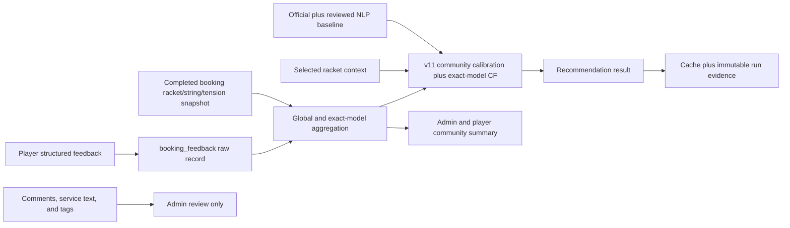

# Community Feedback Calibration Development Design

## Document Status

| Field | Value |
| --- | --- |
| Status | V11 recommendation core and community presentation implemented |
| Last reviewed | 2026-08-13 |
| Scope | Approved 12-string cohort with racket-model context |
| Baseline recommendation algorithm | `fyp1_similarity_preferences_v9` |
| Active recommendation algorithm | `fyp1_similarity_preferences_community_racket_cf_v11` |
| Implementation status | Scoring, feedback collection, aggregation, cache, audit, APIs, and dedicated catalog/admin community-summary panels implemented |
| Model policy | New user comments do not enter MacBERT or any other model |
| Promotion policy | No automatic workbook or candidate-artifact promotion |

This document is a development handoff, not authorization to change production
data or promote an NLP artifact. Implementation and activation remain separate
review gates.

## Current Capability Status

| Capability | Status | Current behaviour | Remaining scope |
| --- | --- | --- | --- |
| Fuzzy racket similarity | **Explicit non-goal; not planned** | V11 normalizes case, Unicode, punctuation, and whitespace, then requires the exact `brand:model` key. It never borrows evidence from a merely similar racket model. | None. Cross-model fuzzy inference is outside the FYP scope. |
| Standard racket identity | **Implemented** | Racket Passport create/edit uses an authenticated six-model backend catalogue. The server validates `model_key`, canonicalizes display values, and maps `Other model` to global-only evidence. | Expand the catalogue only when the FYP cohort intentionally adds a verified model. |
| Automatic CF weight adjustment | **Implemented** | Each candidate recalculates its CF weight from the current distinct supporting-user count: `0` below three users, otherwise `min(0.20, 0.20 * n / (n + 10))`. The applied weight, confidence, support count, policy version, and fallback reason are stored in recommendation evidence. | Automated tuning of the fixed threshold, shrinkage constant, or maximum weight remains deferred. |
| Feedback safeguards and governance | **Baseline safeguards implemented; advanced governance is an explicit non-goal** | Existing safeguards require an authenticated booking owner, a completed booking, one feedback row per booking, 1-to-5 validation, delayed durability, approved strings, per-user averaging, bounded influence, and PII-free aggregate output. Owners can update their feedback. | None for FYP. Feedback deletion, reporting, moderation queues, reputation, and anomaly detection are not planned. |

These statuses must not be shortened to “all three are unfinished.” The active
system already contains dynamic CF weighting and baseline feedback abuse
controls. Fuzzy cross-model inference and advanced feedback governance are
explicit non-goals, not unfinished backlog items.

## Decision Summary

StringSence will keep the official and reviewed NLP data as the stable baseline.
New booking feedback will be stored as structured runtime data and used to
calculate a bounded community calibration signal.

The system will:

1. keep `booking_feedback` as the raw source of truth;
2. exclude comment text, service text, tags, usernames, and phone numbers from
   recommendation input;
3. aggregate only eligible structured string-performance ratings at both the
   global string level and the exact racket-model/string level;
4. calibrate the existing effective feature score without overwriting official
   data, the protected V9 workbook, or NLP matrix rows;
5. cap the community influence and shrink it when the distinct-user count is
   small;
6. invalidate derived recommendation caches whenever eligible feedback changes;
7. record the policy version, source version, sample count, and applied weight in
   recommendation evidence;
8. use the selected racket context when available and fall back to the global
   string aggregate when exact-model evidence is absent;
9. display local-player feedback separately from the baseline performance
   profile.

The active implementation uses PostgreSQL aggregation and existing backend
modules. It will not add a model service, vector database, job queue, scheduled
retraining pipeline, or persisted community-summary table.

### Continuous optimization semantics

"Continuous" means that an eligible feedback create or update automatically
changes the community evidence used by the next recommendation generation. No
administrator needs to rebuild or promote a matrix.

It does not mean background training or eager regeneration for every user:

- saved v9 results and immutable recommendation runs are never rewritten;
- v10 comparison and active v11 cache rows become stale when eligible community
  or collaborative evidence changes;
- the next explicit `POST /api/recommendations/profile` or
  `POST /api/recommendations/generate` recalculates against the latest aggregate;
- a cached-result request never performs a hidden write. When no current v11
  cache exists, mobile offers an explicit "Refresh recommendations" action.

When a recommendation includes a selected racket, the next generation uses the
latest eligible aggregate for that exact normalized racket model and candidate
string. Without exact-model evidence, it uses the global string aggregate; it
never fabricates a same-brand or fuzzy-model result.

## Relationship to Existing NLP Work

The completed MacBERT work remains useful as an offline aspect-conditioned
classifier and evidence aggregator for the historical review corpus. It is not a
chatbot and is not a direct scoring service.

Experimental candidate-run artifacts remain `not_promoted`. This design does
not promote an experiment and does not modify:

- `ml/nlp-workbench-latest/output/latest_macbert_review_matrix_system12.xlsx`;
- `ml/nlp-workbench-latest/output/latest_practical_string_feature_matrix_v9_v8dict.xlsx`;
- any `output/runs/<run-id>/` candidate artifact;
- the synchronous `POST /api/bookings/{booking_id}/feedback` path to call a
  model;
- the Silver training dataset or frozen MacBERT weights.

This document supersedes only the future-feedback integration direction in
`docs/superpowers/specs/2026-05-31-bert-absa-review-optimization-design.md`.
Historical NLP training and artifact-governance statements in that document
remain valid.

## Current System Evidence

### Runtime path

The active path is:

```text
Expo mobile
  -> FastAPI routes
  -> GenerateRecommendationUseCase
  -> Fyp1ContentRecommendationScorer
  -> PostgreSQL catalog, matrix, cache, and audit records
```

The active V11 scorer uses the official and reviewed NLP layers as its stable
baseline, applies eligible `community_signal` calibration to supported physical
features, and then applies bounded exact-racket-model CF when at least three
distinct supporting users exist. Sparse or missing CF evidence preserves the
community-calibrated base score.

### Current feedback path

The player submits feedback through:

```text
mobile/app/player/feedback/[bookingId].tsx
  -> mobile/services/backendApi.ts
  -> POST /api/bookings/{booking_id}/feedback
  -> booking_feedback
  -> Admin feedback list/export
```

The backend already enforces:

- the booking belongs to the authenticated customer;
- the booking status is `completed`;
- only one feedback record exists per booking;
- the main and detail ratings are within 1 to 5 at the DTO boundary;
- comments and tags are not sent to an NLP service.

Each booking also stores the selected `racket_id` when available, a historical
racket brand/model snapshot, the installed string, and requested tension. These
booking-owned snapshots make contextual feedback possible without changing the
feedback table into a second booking record.

### Feedback collection corrections implemented

The mobile form now starts required and optional ratings, including
`would_use_again`, in an unanswered state. Structured-only feedback is accepted;
comment text and tags are optional and never enter recommendation scoring.

The form separates three different meanings:

- service quality;
- recommendation quality;
- string-performance experience.

Only explicitly confirmed structured string-performance fields can influence
recommendations.

### Migration alignment implemented

Forward-only migration `20260813_0029_feedback_provenance.py` adds the missing
`ck_booking_feedback_detail_ratings` database constraint together with
`durability_rated_at` and `structured_field_confirmed_at`. PostgreSQL migration
and integration validation are required release checks.

## Goals

1. Let verified customers improve local recommendation evidence after a
   completed stringing booking.
2. Continuously update both the global string score and the exact
   racket-model/string score when eligible feedback changes.
3. Preserve the official/NLP baseline and reproduce how every recommendation
   was produced.
4. Prevent one user, one booking, or a small sample from dominating a string.
5. Treat durability as the string's long-term durability, not as an immediate
   service-completion rating.
6. Keep the implementation small enough for the FYP runtime and current data
   volume.

## Non-goals

- Feeding new comment text into MacBERT
- Real-time or batch inference on new user comments
- Automatic model retraining
- Automatic matrix promotion
- Replacing the content-based recommender with collaborative filtering
- Implementing collaborative filtering inside this feedback module; CF is owned
  by `2026-05-31-context-aware-cf-recommendation-design.md`
- Changing official manufacturer values
- Overwriting historical `community_rating` or `review_count` catalog fields
- Adjusting all nine core features when the feedback form has evidence for
  only four
- Building feedback deletion/reporting/moderation, fraud detection, reputation
  scoring, queues, stream processing, or a data warehouse for the FYP

## Terminology and Data Ownership

| Term | Meaning | Owner |
| --- | --- | --- |
| Baseline feature | Existing official/NLP effective feature before local feedback | Catalog and recommendation matrix |
| Raw feedback | One customer's response for one completed booking | `booking_feedback` |
| Global community score | Aggregated normalized ratings for one string across racket contexts | Runtime SQL aggregation |
| Context community score | Aggregated normalized ratings for one exact racket-model/string pair | Runtime SQL aggregation |
| Racket model key | Deterministically normalized booking snapshot of brand and model | Aggregation module |
| Effective feature | Baseline after bounded community calibration | Recommendation scorer |
| Community source version | Digest of eligible structured feedback and policy version | Aggregation module |
| Historical community metric | Existing seeded `community_rating` and `review_count` | Catalog import history |

Historical community metrics and new local feedback must not be merged because
their collection methods and provenance are different.

## Target Architecture



### Module boundaries

The aggregation module is the seam between raw operational feedback and the
recommendation domain. It must hide:

- booking/status joins;
- eligibility rules;
- per-user deduplication;
- per-string and exact racket-model/string aggregation;
- deterministic racket identity normalization;
- confidence calculation;
- source-version generation.

Its Interface returns a typed mapping keyed by context type, normalized racket
model key when applicable, catalog ID, and feature key:

```text
CommunityFeatureAggregate
  context_type: global_string | exact_racket_model
  racket_model_key: nullable
  normalized_score
  distinct_users
  booking_count
  confidence
  policy_version
  source_version
  last_feedback_at
```

For each candidate, the adapter selects at most one aggregate: exact racket-model
evidence when the target context has it, otherwise global string evidence. The
same feedback must not be applied once globally and again contextually in one
score.

The recommendation adapter passes this mapping to the scorer separately from
`matrix_by_source`. Do not put numeric metadata into `evidence_note`, parse text
inside the scorer, or persist new `StringRecommendationMatrix` rows.

`community_signal` remains the evidence-source label used in recommendation
rationale. It is not a persisted matrix layer. This keeps one aggregation seam
for recommendation, admin summary, and player summary callers.

## Feedback Form Design

### Field semantics

| API field | User-facing meaning | Required | Recommendation use |
| --- | --- | ---: | --- |
| `rating` | Overall stringing service satisfaction | Yes on initial submit | Never |
| `recommendation_relevance` | How relevant the recommendation was | No | Recommender KPI only |
| `string_satisfaction` | Overall satisfaction with the installed string on this racket | No | Global and context outcome summary only |
| `tension_satisfaction` | Satisfaction with the string/racket/tension combination | No | Context outcome summary only |
| `comfort` | Comfort during play | No | Calibrates `comfort` |
| `control` | Shuttle placement and control | No | Calibrates `control` |
| `repulsion` | Rebound and repulsion feel | No | Calibrates `repulsion` |
| `durability` | Resistance to wear/breakage and useful playing life | No | Calibrates `durability` only when eligible |
| `would_use_again` | Whether the player would choose the same string again | No | Community summary only |
| `comment` | General note | No | Never; owner/admin display only |
| `string_feedback` | Free-text string experience | No | Never; owner/admin display only |
| `service_feedback` | Free-text service experience | No | Never; owner/admin display only |
| `sentiment_tags` | Quick service/experience tags | No | Never; owner/admin display only |

`tension_satisfaction` must not be mapped to `tension_retention`. Satisfaction
with a chosen tension is contextual; tension retention is the string's ability
to preserve tension over time.

### Interaction rules

1. The required service rating and all optional detail ratings start as `null`,
   not 5. Submission stays disabled until the service rating is selected.
2. `would_use_again` starts as unanswered, not `true`.
3. Each optional rating provides a clear unselected state and a
   "Not enough experience to judge" action.
4. Structured-only feedback is valid. Text and tags are never mandatory.
5. The overall rating is relabeled "Overall stringing service" everywhere.
6. The form visually separates:
   - service experience;
   - recommendation relevance;
   - string playing experience.
7. Existing feedback can be edited by its authenticated booking owner through
   the implemented PATCH endpoint.
8. Empty optional fields are omitted or sent as `null`; they are never replaced
   by a neutral or positive default.
9. Optional values stored by the legacy positive-default form are displayed as
   unconfirmed. They do not become recommendation evidence until the player
   explicitly confirms or replaces each field in the corrected form.

### Durability flow

Durability is a real string-performance dimension, but it needs time to observe.
The immediate feedback form must show:

```text
Durability can be added after you have used the string for at least 7 days.
```

Rules:

- define `completed_at` as the `changed_at` value from the booking status-history
  row whose `new_status` is `completed`;
- never use `booking.updated_at`, `created_at`, expected completion, or device
  time as a completion fallback;
- before seven days from that server-owned `completed_at`, the
  durability control is unavailable;
- after seven days, the customer may add or update durability through the same
  booking-feedback screen;
- the backend records `durability_rated_at` when a non-null durability value is
  accepted or changed;
- only values with an eligible `durability_rated_at` enter aggregation;
- if a reliable completion timestamp is missing, durability remains ineligible;
- seven days is an operational proxy, not a scientific claim. It is one
  centralized policy constant and must be reviewed against real usage.

No notification scheduler is required in the first version. The booking history
can expose an "Add durability feedback" action when eligible. A reminder can be
added later only if completion data shows users are not returning.

## API Contract

### Create feedback

Keep:

```http
POST /api/bookings/{booking_id}/feedback
```

Contract changes:

- `rating` remains required and means service satisfaction only;
- detail ratings and `would_use_again` remain nullable;
- remove the requirement for comment text or a sentiment tag;
- reject duplicate sentiment tags;
- keep `extra="forbid"` and 1-to-5 bounds;
- keep owner, completed-booking, and one-row-per-booking enforcement;
- reject a non-null durability value before `durability_available_at` without
  changing stored feedback;
- set `durability_rated_at` only when the durability eligibility rule passes;
- derive `structured_field_confirmed_at` from optional fields that the player
  explicitly supplied with non-null values; map each field key to server time,
  and never accept this metadata from clients;
- invalidate v10 comparison and active v11 score caches in the same database
  transaction when eligible recommendation evidence changes.

### Update feedback

Implemented endpoint:

```http
PATCH /api/bookings/{booking_id}/feedback
```

The endpoint exists mainly so a player can add durability later. It must:

- require the authenticated booking owner;
- require a completed booking and an existing feedback row;
- accept only explicitly supplied fields;
- reject an empty patch;
- apply the same rating and text limits as create;
- reject a non-null durability value before `durability_available_at`;
- update `durability_rated_at` when durability changes;
- clear both `durability` and `durability_rated_at` when the customer explicitly
  removes the durability answer;
- set the server timestamp for an explicitly supplied non-null structured field
  in `structured_field_confirmed_at`, and remove its key when the field is
  explicitly set to null;
- leave `structured_field_confirmed_at` unchanged for text-only or service-only
  edits;
- invalidate recommendation caches only when one of
  `comfort`, `control`, `repulsion`, or eligible `durability` changes, including
  removal of a previously eligible value;
- leave previous recommendation runs immutable.

Deleting feedback is not implemented and is an explicit FYP non-goal. The owner
update endpoint is the supported correction path for submitted feedback.

### Community summary

Authenticated aggregate responses for the approved cohort are implemented at:

```http
GET /api/strings/community-summary
GET /api/admin/feedback/community-summary
```

Declare the static player route before `GET /api/strings/{string_id}` so
`community-summary` is not interpreted as a string ID. The same aggregation
module should serve player and admin presentation so the numbers cannot drift.

`FeedbackOut` exposes server-derived durability state:

```json
{
  "durability_available_at": "2026-08-18T12:00:00Z",
  "can_rate_durability": false,
  "durability_rated_at": null,
  "structured_field_confirmed_at": {
    "comfort": "2026-08-12T12:00:00Z",
    "control": "2026-08-12T12:00:00Z"
  }
}
```

Mobile must use this server decision rather than calculating eligibility from
the device clock.

Suggested response shape:

```json
{
  "policy_version": "community_feedback_v1",
  "strings": [
    {
      "string_id": "string-id",
      "features": {
        "comfort": {
          "score": 0.75,
          "distinct_users": 5,
          "booking_count": 7,
          "confidence": 0.3333,
          "evidence_status": "developing"
        }
      },
      "string_satisfaction": 4.2,
      "would_use_again_ratio": 0.8,
      "last_feedback_at": "2026-08-11T12:00:00Z"
    }
  ]
}
```

The player catalog summary remains global. The authenticated recommendation and
admin audit may additionally expose an exact-model context block:

```json
{
  "racket_context": {
    "brand": "Yonex",
    "model": "Astrox 88D Pro",
    "normalized_model_key": "yonex:astrox 88d pro"
  },
  "strings": [
    {
      "string_id": "gosen-ryzonic-65",
      "evidence_scope": "exact_racket_model",
      "distinct_users": 1
    }
  ]
}
```

The response must not contain user IDs, usernames, phone numbers, comment text,
or booking IDs. `last_feedback_at` is the latest applicable field-confirmation
timestamp, not the row-level `updated_at`.

## Database Design

### Existing table remains authoritative

Continue using `booking_feedback`. Do not create a community-summary table in
the first version.

The implemented migration adds two server-owned columns:

```text
durability_rated_at TIMESTAMPTZ NULL
structured_field_confirmed_at JSON NOT NULL DEFAULT {}
```

Forward-only Alembic migration `20260813_0029_feedback_provenance.py`:

1. adds `durability_rated_at`;
2. adds `structured_field_confirmed_at` with an empty object for every historical
   row;
3. adds the missing `ck_booking_feedback_detail_ratings` constraint;
4. does not rewrite existing nullable detail ratings;
5. leaves existing durability rows with `durability_rated_at=NULL`.

The empty historical confirmation map is the cutover seam. It excludes every
legacy optional default, including comfort, control, repulsion,
string-satisfaction, and would-use-again values. A later corrected-form edit can
confirm individual fields without deleting the original raw record.

The downgrade may remove the new columns and constraint, but runtime rollout must
not depend on downgrade for data recovery.

### Required indexes

Reuse existing indexes on `booking_feedback.user_id`,
`booking_feedback.booking_id`, and `bookings.string_id`. Do not add another index
until `EXPLAIN ANALYZE` on real PostgreSQL data shows a need.

Do not add racket brand/model columns to `booking_feedback`. Context comes from
the associated immutable booking snapshot. The existing nullable `racket_id`
continues identifying one physical racket for personal history, while normalized
booking brand/model supports exact-model aggregation across users.

## Eligibility and Aggregation

### Eligible records

A feedback row contributes only when:

- its booking belongs to an approved catalog ID;
- the booking reached `completed`;
- the selected feature key has a server timestamp in
  `structured_field_confirmed_at`;
- the selected feature is non-null;
- the feature value is within 1 to 5;
- for durability, `durability_rated_at` is at least seven days after the booking
  status-history completion timestamp.

Every eligible row may enter the global string aggregate. It enters an exact
racket-model aggregate only when the booking snapshot maps to one of the six
server-catalogued FYP model keys. Missing and custom racket identity never falls
into a made-up `unknown-racket` cohort and never shares a `null` context bucket.

Service ratings, text, tags, recommendation relevance, and tension satisfaction
never enter the physical-feature aggregate.

### Normalization

Convert a 1-to-5 rating to the scorer's 0-to-1 scale:

```text
normalized_rating = (rating - 1) / 4
```

This preserves the endpoints exactly:

| Rating | Normalized |
| ---: | ---: |
| 1 | 0.00 |
| 2 | 0.25 |
| 3 | 0.50 |
| 4 | 0.75 |
| 5 | 1.00 |

### Preventing frequent-user dominance

Aggregate in two stages for each evidence scope and feature:

1. for global evidence, average bookings for the same
   `user_id + string_id + feature`;
2. for contextual evidence, average bookings for the same
   `user_id + racket_model_key + string_id + feature`;
3. average those per-user values across distinct users inside that scope.

`booking_count` remains available for display, but influence is based on
`distinct_users`.

The selected aggregate rule is deliberately small:

```text
if target racket has eligible exact-model/string/feature evidence:
    selected aggregate = exact-model aggregate
else:
    selected aggregate = global string aggregate
```

One recommendation applies one selected aggregate per feature. It does not blend
the same feedback globally and contextually a second time.

### Confidence and influence

Central policy constants:

```text
COMMUNITY_POLICY_VERSION = "community_feedback_v1"
COMMUNITY_SHRINKAGE_K = 10
COMMUNITY_MAX_WEIGHT = 0.30
DURABILITY_MIN_AGE_DAYS = 7
```

For each global or exact-model scope, string, and feature:

```text
confidence = distinct_users / (distinct_users + COMMUNITY_SHRINKAGE_K)
community_weight = COMMUNITY_MAX_WEIGHT * confidence
effective_score =
    baseline_score * (1 - community_weight)
    + community_score * community_weight
```

Examples:

| Distinct users | Confidence | Community weight |
| ---: | ---: | ---: |
| 0 | 0.0000 | 0.00% |
| 1 | 0.0909 | 2.73% |
| 5 | 0.3333 | 10.00% |
| 10 | 0.5000 | 15.00% |
| 20 | 0.6667 | 20.00% |

There is no hard minimum sample count. Low samples have low influence rather
than causing a discontinuous on/off change. Presentation may label fewer than
three distinct users as `limited` evidence. Presentation labels are:

| Distinct users | Evidence label |
| ---: | --- |
| 0 | No local evidence |
| 1-2 | Limited |
| 3-9 | Developing |
| 10 or more | Established |

These labels affect presentation only; the continuous confidence formula
controls recommendation influence.

Context labels must include their scope. For example, “Limited evidence for
Yonex Astrox 88D Pro” is acceptable; “this string works best with this racket”
is not supported by one user's rating.

### Zero-feedback invariant

When a feature has no eligible local feedback:

```text
effective_score == existing v9 baseline score
```

This invariant must have a focused regression test.

## Recommendation Integration

### Candidate loading

`SqlAlchemyRecommendationRepository.list_active_candidates()` continues loading
the approved 12 active candidates and persisted matrix inputs. The aggregation
adapter performs one additional grouped query for those catalog IDs, global
scope, and the selected exact racket-model scope. It returns the typed
`CommunityFeatureAggregate` mapping defined above.

`GenerateRecommendationUseCase` passes candidates and the aggregate mapping to
the scorer together with the already validated target racket context. The scorer
must not query SQL, normalize raw booking text, parse `evidence_note`, or infer
counts from a display DTO. Do not insert community signals into
`string_recommendation_matrix`.

### Scoring order

For each supported core feature:

1. calculate the current official/NLP baseline using exact v9 rules;
2. select the exact-model aggregate for the target racket when available,
   otherwise the global string aggregate;
3. calculate bounded community weight;
4. produce the calibrated effective feature;
5. continue through preference matching, rule fit, and final ranking.

Community calibration must not be applied twice. Its confidence determines its
feature influence; it must not also become a separate final-score component.

The later v11 CF layer consumes completed-booking behavior, not this aggregate's
raw feedback rows. That prevents feedback from being counted again as a CF
interaction outcome.

Supported v1 feature mapping:

```text
comfort    -> comfort
control    -> control
repulsion  -> repulsion
durability -> durability, eligible delayed ratings only
```

The system must not invent local signals for `sound`, `elasticity`,
`tension_retention`, or `string_movement` until explicit structured questions
exist for them.

### Algorithm version

Any enabled community influence changes recommendation behavior. Therefore set:

```text
COMMUNITY_COMPARISON_VERSION = "fyp1_similarity_preferences_community_v10"
ALGORITHM_VERSION = "fyp1_similarity_preferences_community_racket_cf_v11"
```

Do not overwrite or reinterpret historical v9 or earlier runs.

## Versioning and Audit Evidence

### Community source version

Generate one deterministic SHA-256 digest from:

- policy version;
- evidence scope and normalized racket-model key when contextual;
- approved string ID;
- feature key;
- eligible feedback ID;
- the feature's server timestamp from `structured_field_confirmed_at`;
- structured numeric value;
- `durability_rated_at` and the server-owned completion timestamp when
  applicable.

Sort canonical records before hashing. Do not include comments, service text,
tags, usernames, phone numbers, or the row-level `updated_at`. A text-only edit
must not change a recommendation source version.

Generate a cohort-level `community_snapshot_version` by hashing the policy
version and the sorted global and exact-model source versions. Recommendation
generation and cached-result validation use this one snapshot value.
An empty eligible-evidence set still produces a deterministic snapshot from the
policy version and an empty source-version list; it is not a versioning failure.

### Recommendation rationale

For each calibrated feature, add evidence similar to:

```json
{
  "feature_key": "control",
  "community_evidence_scope": "exact_racket_model",
  "community_racket_model_key": "yonex:astrox 88d pro",
  "baseline_score": 0.72,
  "community_score": 0.80,
  "community_distinct_users": 5,
  "community_booking_count": 7,
  "community_confidence": 0.3333,
  "community_weight": 0.10,
  "effective_score": 0.728,
  "community_policy_version": "community_feedback_v1",
  "community_source_version": "sha256:..."
}
```

Store `community_snapshot_version` once at the recommendation-rationale root,
not once per feature-evidence row.

Do not add matrix/source-version columns to the run schema. Persist the
algorithm, policy, per-feature source, and cohort snapshot versions inside the
immutable request/rationale JSON, and invalidate v10 score caches transactionally
whenever eligible feedback changes.

Recommendation logs and runs remain immutable even after later feedback changes.

## Cache Policy

The existing cache key is:

```text
(user_id, catalog_id, algorithm_version)
```

The smallest correct v1 policy is therefore:

- after creating, updating, or removing eligible physical-feature feedback,
  delete both v10 comparison rows and active
  `fyp1_similarity_preferences_community_racket_cf_v11` rows in the same
  transaction;
- do not delete recommendation runs or logs;
- do not attempt per-string or per-user invalidation until cache volume or
  write frequency proves global invalidation inadequate.

Changing only service text, service rating, tags, or recommendation relevance
does not change the community snapshot and does not require cache invalidation.

Before writing v10 cache rows, generation verifies that the cohort snapshot used
for scoring is still current. If it changed during scoring, rerun once; if it
changes again, return a retryable conflict instead of caching stale results.

On cached reads, compare the stored rationale snapshot with the current cohort
snapshot. A mismatch is treated as no current cache, even if a concurrent writer
inserted an old row after invalidation. The mobile client then offers the
explicit refresh action described above.

## Player Experience

### Feedback screen

`mobile/app/player/feedback/[bookingId].tsx` now:

- separate service, recommendation, and string sections;
- remove positive defaults;
- allow structured-only submission;
- show unanswered states;
- explain how local structured ratings may improve recommendations;
- state clearly that free text is not used by the recommendation model;
- support editing after initial submission;
- enable delayed durability when eligible;
- preserve loading, error, completed-booking, existing-feedback, and success
  states;
- retain accessible labels, roles, touch targets, and error announcements.

### String catalog presentation

The player string-detail screen keeps the existing performance profile and radar
values, then presents a separate "Local player feedback" section containing:

- average structured rating by supported feature;
- distinct-player count;
- `limited`, `developing`, or `established` evidence label;
- no value when there is no eligible evidence;
- a statement that local feedback is a calibrated community signal, not an
  official specification.

The public string detail uses global evidence only. A racket-specific result is
shown only inside an authenticated recommendation for a player-selected racket,
with the exact model and evidence count visible. Never silently present one
racket model's outcome as a universal string property.

## Admin Experience

The raw feedback list and CSV export are implemented for operational review. The
admin page also consumes the backend read-only community-summary endpoint and
groups evidence first by global or exact-racket-model scope, then by approved
string and feature.

It must show:

- string name and ID;
- global or exact-racket-model scope and normalized model identity;
- normalized and 1-to-5 display values;
- distinct-user count and booking count;
- eligibility status;
- last eligible feedback timestamp;
- source and policy versions;
- whether the recommendation effect is shadow-only or enabled.

Admin analytics must continue treating `rating` as service feedback. It must not
rename the existing service average to a string-performance score.

## Privacy and Abuse Boundaries

- Only authenticated owners of completed bookings can create or update
  feedback.
- One feedback row per booking remains the anti-spam boundary.
- Per-user averaging prevents repeat customers from dominating a string.
- Aggregate APIs never expose PII or raw comments.
- The recommendation path never reads admin CSV exports.
- Comment text remains visible to authorized admin flows only and is not part of
  source-version hashing.
- No claim of anonymity should be shown in the raw admin view because admins can
  currently see customer identity.
- No advanced fraud model, deletion/report workflow, or moderation queue is
  planned for the FYP. The controls above are the final FYP abuse boundary.

## Failure Behaviour

| Failure | Required behaviour |
| --- | --- |
| No community feedback | Return exact baseline behavior |
| Aggregation query fails | Fail recommendation request visibly; do not silently use a stale or partial aggregate |
| One malformed optional value | Reject at API boundary and database constraint |
| Missing completion timestamp | Exclude durability only; keep other eligible fields |
| Cache invalidation fails | Roll back the feedback write in the same transaction |
| Community source or snapshot version unavailable | Fail recommendation generation visibly; never apply an unversioned partial aggregate |
| Unknown or non-approved string | Exclude from aggregate and recommendation |
| Comment contains unsupported language | Store within existing limits; never invoke a model |

## Implementation Record

### Phase 1: Correct feedback collection — completed

Files changed include:

- `mobile/app/player/feedback/[bookingId].tsx`
- `mobile/types/domain.ts`
- `mobile/services/backendApi.ts`
- `mobile/services/backendMappers.ts`
- `backend/app/dto/racket_feedback.py`
- `backend/app/entrypoints/api/routes/racket_feedback_routes.py`
- `backend/app/adapters/persistence/sqlalchemy/models/racket_feedback.py`
- a new forward-only Alembic migration
- `backend/tests/test_rackets_feedback.py`
- one focused mobile feedback-form policy test

Deliverables:

- nullable detail-state UI;
- structured-only submission;
- semantic labels;
- patch endpoint;
- delayed durability metadata;
- server-owned `structured_field_confirmed_at` provenance;
- missing database constraint;
- no recommendation behavior change yet.

### Phase 2: Build and inspect community aggregates — completed

Implemented backend changes include:

- one small SQLAlchemy community-feedback aggregation adapter with the typed
  Interface defined above;
- aggregate DTOs;
- player and admin community-summary routes and their dedicated read-only panels;
- aggregation tests for racket identity normalization, global/context selection,
  per-user averaging, durability eligibility, approved-cohort filtering, and
  source-version determinism.

The aggregation seam is shared by admin presentation and recommendation
generation. It preserves distinct-user counts, evidence scope, and deterministic
source versions.

### Phase 3: Enable community calibration and V11 CF — completed

Implemented changes include:

- `backend/app/adapters/persistence/sqlalchemy/repositories/sqlalchemy_recommendation_repository.py`
- `backend/app/domain/recommendation/scoring.py`
- `backend/app/use_cases/recommendation/generate_recommendation.py`
- cache invalidation shared by feedback create/update;
- snapshot validation for cache writes and reads;
- recommendation evidence and version handling;
- `backend/tests/test_recommendation_use_case.py`;
- PostgreSQL integration coverage in `backend/tests/test_unified_backend_flows.py`.

Community weighting is the V10 comparison component. The active V11 runtime adds
exact-racket-model collaborative evidence with a three-user gate and a dynamic,
bounded weight. V10 remains a distinguishable comparison version.

### Phase 4: Player and admin community presentation — completed

The player string-detail page shows global local-player evidence separately from
the official/review-derived profile. The Admin Feedback page can switch between
global and exact-racket-model snapshots, follows the existing string filter, and
shows the normalized rating, player/booking counts, evidence scope, and applied
community weight. These panels are read-only and do not alter scorer logic.

## Test Plan

### Backend unit and integration tests

1. POST accepts a service rating plus structured detail ratings without text or
   tags.
2. Detail fields remain null when unanswered.
3. Duplicate tags and out-of-range values are rejected.
4. Non-owner, incomplete-booking, and duplicate-create rules remain enforced.
5. PATCH updates only supplied fields.
6. PATCH cannot update a booking owned by another customer.
7. Durability before the eligibility date is rejected without changing stored
   feedback.
8. Eligible durability records `durability_rated_at` from server time.
9. Durability eligibility uses the completed status-history timestamp and no
   mutable timestamp fallback.
10. Every historical row starts with no confirmed structured fields, so legacy
    positive defaults are excluded.
11. Explicitly confirming, replacing, or clearing one structured field updates
    only that field's provenance.
12. Repeated bookings by one user are averaged before cross-user aggregation.
13. Standard racket keys are server-validated and canonical across users;
    unknown submitted keys are rejected.
14. Missing or custom racket identity contributes to global evidence only and
    never creates a shared null-racket context.
15. Exact-model evidence is selected when available; otherwise scoring falls
    back to global string evidence.
16. One score never applies the same feedback globally and contextually.
17. Unsupported and unconfirmed fields never enter the community aggregate.
18. Only the approved 12 strings appear.
19. Source-version hashing is deterministic and changes only when eligible
    structured evidence changes; a text-only edit leaves it unchanged.
20. Zero feedback produces the same effective features and ordering as v9.
21. One-user feedback has approximately 2.73% maximum feature influence.
22. Community influence never exceeds 30%.
23. Eligible feedback mutation invalidates v10 cache and leaves run/log history
    intact.
24. A stale cohort snapshot is rejected on cache write and cache read.
25. Recommendation rationale contains context scope, baseline, community, count,
    weight, policy, source, and snapshot evidence.
26. The Alembic head and ORM constraint definitions remain aligned.

### Mobile tests

1. No rating is preselected, and service rating is required before submission.
2. `would_use_again` is unanswered initially.
3. Structured-only submission is allowed.
4. Service, recommendation, and string sections have distinct labels.
5. Durability availability follows backend eligibility metadata.
6. Legacy optional values are shown as unconfirmed and require explicit player
   confirmation before recommendation use.
7. Existing feedback can enter edit mode.
8. An invalidated shortlist offers an explicit refresh action instead of silently
   regenerating through a GET request.
9. Loading, error, validation, success, and read-only states remain accessible.

### Required validation commands

```bash
cd backend
./scripts/alembic upgrade head
./.venv/bin/ruff check .
./.venv/bin/ruff format --check .
./.venv/bin/mypy app ai_service tests
./.venv/bin/pytest -v

cd ../mobile
npm test
npx tsc --noEmit
npm run lint
```

Run the PostgreSQL-backed feedback and recommendation flow; SQLite metadata-only
tests are not sufficient evidence for the Alembic constraint.

## Acceptance Criteria

The design is complete when all of the following are true:

- [x] New user comment text is never passed to MacBERT or another model.
- [x] Unanswered detail ratings are stored as null.
- [x] Historical positive defaults remain stored but are excluded until a player
      explicitly confirms each structured field.
- [x] Structured-only feedback can be submitted.
- [x] Service, recommendation, and string-performance meanings are separated.
- [x] Durability means long-term string durability and only eligible delayed
      ratings affect it.
- [x] Only feedback created by the authenticated owner of a completed booking
      can contribute.
- [x] Only the approved 12 strings are aggregated.
- [x] Repeat bookings are first averaged per user and evidence scope.
- [x] Standard Racket Passports use the authenticated backend catalogue and a
      server-owned canonical model key.
- [x] Exact normalized racket-model evidence is used only for the selected
      racket; otherwise scoring falls back to global string evidence.
- [x] Missing or fuzzy racket identity never creates inferred physical
      similarity.
- [x] The same feedback is not applied twice in one feature score.
- [x] Zero feedback preserves the previous baseline result.
- [x] Community influence is bounded at 30% per supported feature.
- [x] Official values, V9, NLP rows, and historical catalog community metrics are
      unchanged.
- [x] Cache invalidation prevents stale community-calibrated recommendations.
- [x] Recommendation evidence records counts, weights, policy, source, and
      snapshot versions.
- [x] Aggregate outputs contain no PII or comment text.
- [x] Backend, migration, mobile, and PostgreSQL integration checks pass.
- [x] CF weight is zero below three supporting users, increases with support,
      and never exceeds 20%.
- [x] V11 activation preserves explicit algorithm and evidence versions.

## Rollback

If active V11 produces unacceptable recommendation changes:

1. restore the scorer to the exact v9 baseline behavior under a new corrective
   algorithm version or disable community application in a reviewed code change;
2. clear V10 comparison and active V11 `recommendation_score_cache` rows;
3. keep all raw feedback and immutable recommendation runs;
4. do not roll back or overwrite the protected V9 workbook;
5. compare stored evidence to identify which feature and sample caused the
   change.

The raw feedback collection improvements can remain active even if community
calibration is disabled.

## Explicit Non-Goals

The following are closed FYP scope decisions and must not be reported as
unfinished work:

- fuzzy or learned cross-model racket similarity; exact normalized-model
  matching remains the only racket identity tier;
- feedback deletion, reporting, and admin moderation workflows; owner feedback
  update and the read-only admin evidence view remain active;
- account reputation, anomaly detection, and coordinated-abuse detection; the
  existing booking ownership, uniqueness, per-user averaging, and bounded-weight
  safeguards remain active.

## Deferred or Partial Work

The following are deliberately deferred:

- push reminders for delayed durability;
- local signals for sound, elasticity, tension retention, and string movement;
- per-string cache invalidation;
- persisted aggregate/materialized views;
- historically complete racket weight/balance snapshots;
- automated tuning of the CF support threshold, shrinkage constant, or maximum
  weight; runtime CF weight adjustment from supporting-user count is already
  active;
- retraining or promoting MacBERT from runtime feedback.

Add these only when actual data volume, user completion behavior, or measured
recommendation quality shows that the simpler design is insufficient.

## Decisions Applied to V11

1. `rating` remains the required service rating rather than being renamed at the
   database level.
2. Seven days is the initial durability eligibility proxy.
3. Community calibration uses `K=10` and a maximum 30% feature weight.
4. V11 CF uses a three-distinct-user activation gate, `K=10`, and a maximum 20%
   final-score weight.
5. Exact normalized brand/model matching is the only contextual cross-user
   racket identity tier; fuzzy cross-model inference is disabled.
6. Public catalog summaries remain global while racket-specific evidence appears
   only in authenticated recommendation and admin views.
7. Fuzzy racket similarity and advanced feedback deletion/moderation are outside
   the FYP scope and are not future implementation requirements.
